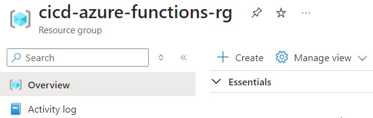
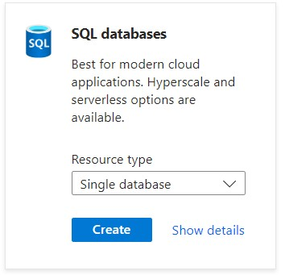
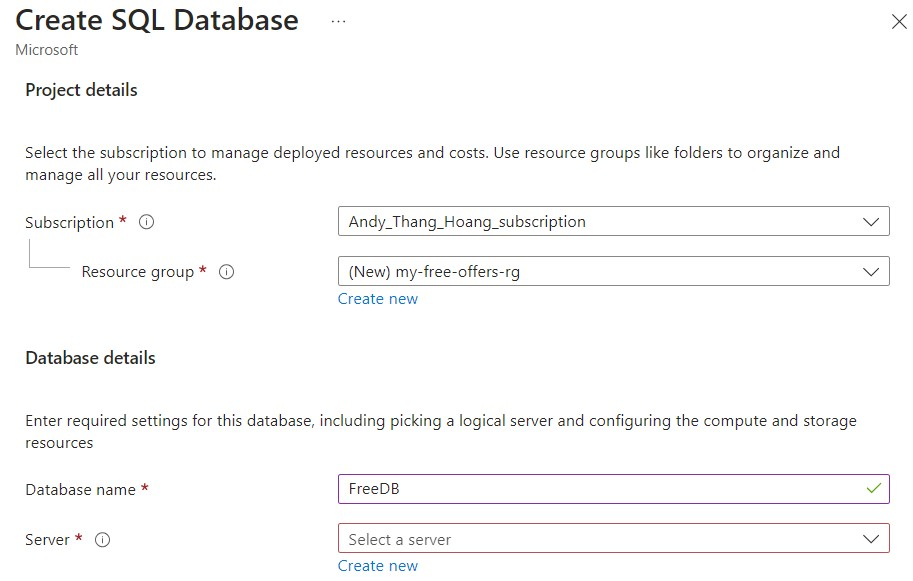
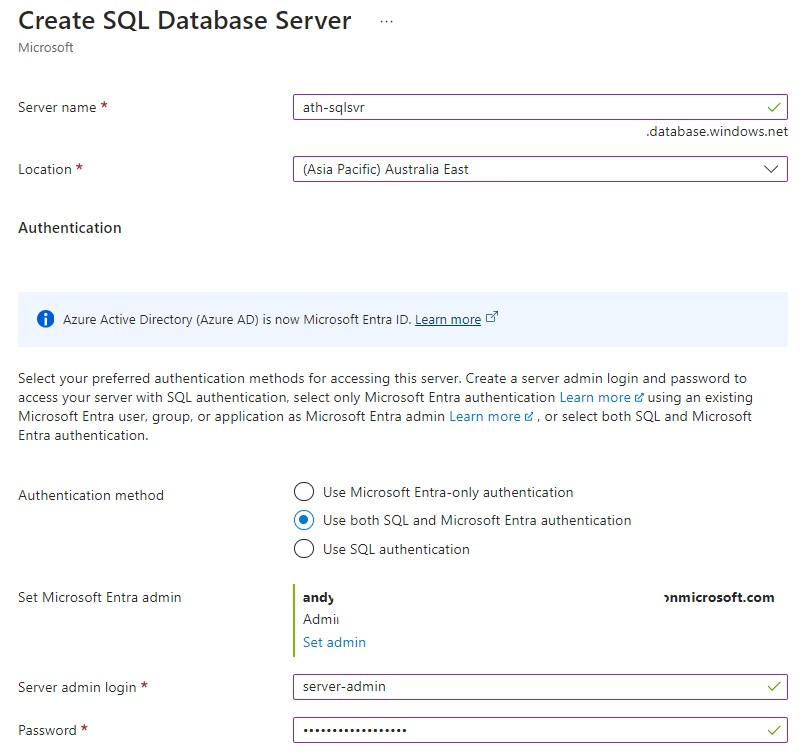
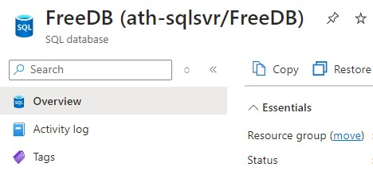
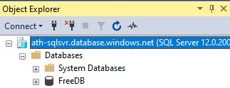
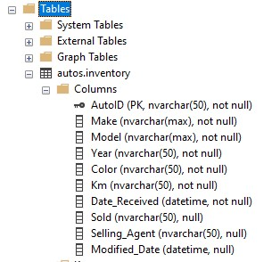
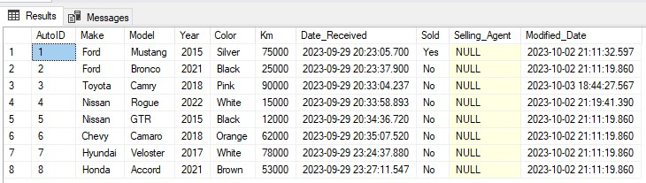
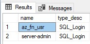

# Hands-On Lab Azure SQL Setup

## Setup Azure Resource Group

First, we will need an Azure Subscription to move forward.
After logging in via the Azure Portal, create a resource group. I called mine cicd-azure-functions-rg.

 


## Setup Azure SQL Server and DB

Create an Azure SQL Server. Within cicd-azure-functions-rg resource group, click the Create button and search for Azure SQL.
Select Create, SQL databases and select Single Database Option and click Create

  


Under Project Details, select subscription and resource group. (I have a free sql database offer, so I select my-free-offers-rg).
Under Database details, typed FreeDB for the databasename

  


For Server, click Create new
Provide a unique name for the Server and select Use both SQL and Microsoft Entra authentication.
For Set Microsoft Entra Admin, select an Azure identity.
Fill out your Server Admin login and password. Important - Don't forget what you set here.

  


Back on the Create SQL Database page.

    * Compute + Storage:  Standard-series (Gen5), 2 vCores, 32 GB storage
    * Backup Storage redundancy:  Locally-redundant storage


Click next: Networking 
_ connectivity method: public endpoint
_ for Firewall rules, set Allow Azure services and resources to access this server set to Yes. Set Add current client IP address to Yes. 
_ Leave other options as default.

    * Remaining options are default and click review + create.
    * On the create sql database overview page, click create button

  


## SQL Management Studio

Connect to sql server and import the schema and table to your database.
Launch SQL Server Management Studio and connect to your Azure SQL DB Server

For Example:

  


## Create a new table with entries

Within a new sql query window, run the following sql query:

```
	SET DATEFORMAT ymd
	SET ARITHABORT, ANSI_PADDING, ANSI_WARNINGS, CONCAT_NULL_YIELDS_NULL, QUOTED_IDENTIFIER, ANSI_NULLS, NOCOUNT ON
	SET NUMERIC_ROUNDABORT, IMPLICIT_TRANSACTIONS, XACT_ABORT OFF
	GO

    CREATE SCHEMA autos;

	CREATE TABLE autos.inventory (
	    AutoID nvarchar(50) PRIMARY KEY,
	    Make nvarchar(max) NOT NULL,
	    Model nvarchar(max) NOT NULL,
		Year nvarchar(50) NOT NULL,
		Color nvarchar(50) NOT NULL,
		Km nvarchar(50) NOT NULL,
		Date_Received datetime NOT NULL,
		Sold nvarchar(50),
		Selling_Agent nvarchar(50),
		Modified_Date datetime
    );

    INSERT autos.inventory(AutoID, Make, Model, Year, Color, Km, Date_Received, Sold, Selling_Agent, Modified_Date) VALUES (N'1', N'Ford', N'Mustang', N'2015', N'Silver', N'75000', '2023-09-29 20:23:05.700', N'Yes', NULL, '2023-10-02 21:11:32.597')
    INSERT autos.inventory(AutoID, Make, Model, Year, Color, Km, Date_Received, Sold, Selling_Agent, Modified_Date) VALUES (N'2', N'Ford', N'Bronco', N'2021', N'Black', N'25000', '2023-09-29 20:23:37.900', N'No', NULL, '2023-10-02 21:11:19.860')
    INSERT autos.inventory(AutoID, Make, Model, Year, Color, Km, Date_Received, Sold, Selling_Agent, Modified_Date) VALUES (N'3', N'Toyota', N'Camry', N'2018', N'Pink', N'90000', '2023-09-29 20:33:04.237', N'No', NULL, '2023-10-03 18:44:27.567')
    INSERT autos.inventory(AutoID, Make, Model, Year, Color, Km, Date_Received, Sold, Selling_Agent, Modified_Date) VALUES (N'4', N'Nissan', N'Rogue', N'2022', N'White', N'15000', '2023-09-29 20:33:58.893', N'No', NULL, '2023-10-02 21:19:41.390')
    INSERT autos.inventory(AutoID, Make, Model, Year, Color, Km, Date_Received, Sold, Selling_Agent, Modified_Date) VALUES (N'5', N'Nissan', N'GTR', N'2015', N'Black', N'12000', '2023-09-29 20:34:36.720', N'No', NULL, '2023-10-02 21:11:19.860')
    INSERT autos.inventory(AutoID, Make, Model, Year, Color, Km, Date_Received, Sold, Selling_Agent, Modified_Date) VALUES (N'6', N'Chevy', N'Camaro', N'2018', N'Orange', N'62000', '2023-09-29 20:35:07.520', N'No', NULL, '2023-10-02 21:11:19.860')
    INSERT autos.inventory(AutoID, Make, Model, Year, Color, Km, Date_Received, Sold, Selling_Agent, Modified_Date) VALUES (N'7', N'Hyundai', N'Veloster', N'2017', N'White', N'78000', '2023-09-29 23:24:37.880', N'No', NULL, '2023-10-02 21:11:19.860')
    INSERT autos.inventory(AutoID, Make, Model, Year, Color, Km, Date_Received, Sold, Selling_Agent, Modified_Date) VALUES (N'8', N'Honda', N'Accord', N'2021', N'Brown', N'53000', '2023-09-29 23:27:11.547', N'No', NULL, '2023-10-02 21:11:19.860')
    GO
```

Now refresh and you should see the following:

  


Running a select \* sql query shows the table is populated:

  


## Create SQL Authentication account

Create a SQL Auth account that will be used by the Azure Function App.
Within SQL Management Studio, open a new query window, with database is 'master', and leverage the sample below.
Ensure you update your password with your desired password.

```
	CREATE LOGIN az_fn_usr WITH PASSWORD = '<password>';
	GO
```

Switch back to FreeDB database
```
    USE FreeDB;
	CREATE USER az_fn_usr FOR LOGIN az_fn_usr;
	GO
	EXEC sp_addrolemember 'db_datareader', 'az_fn_usr';
	EXEC sp_addrolemember 'db_datawriter', 'az_fn_usr';
	GO
```


Run a new SQL Query to ensure the account is present

```
    USE master;
	SELECT name, type_desc
	FROM sys.sql_logins
	WHERE type_desc = 'SQL_LOGIN'

```


