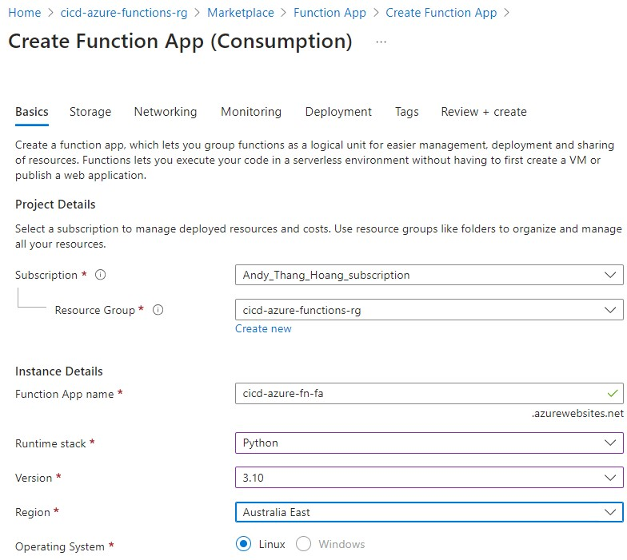
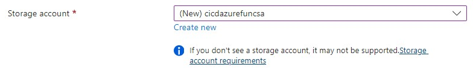
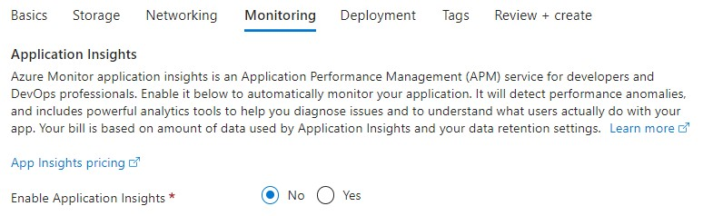
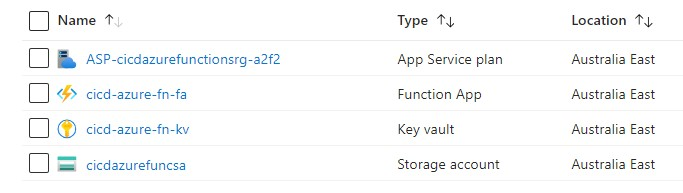
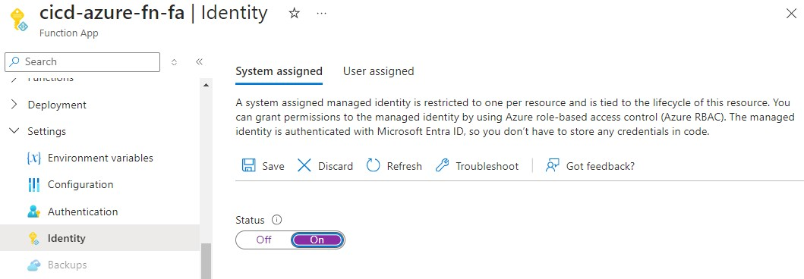
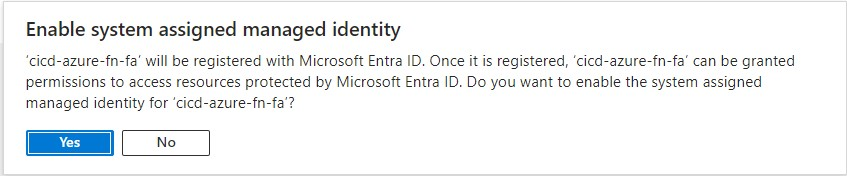

# Azure Function App Setup

## Setup Azure Function App

Within Azure Portal, access cicd-azure-functions-rg resource group and hit create button.
Search: azure function

Select Create, Function App
_ Hosting Plan: Consumption
_ Resource Group: cicd-azure-functions-rg
_ Function App Name: cicd-azure-fn-fa
_ Runtime Stack: Python
_ Version: 3.10

    * Leave remaining options on initial page as default.
    * click the button, Next : Storage

Note: You will need a storage account so can leave the default new one Azure creates or manually create your own.

    * Click button: Next: Networking
    * Leave options as default
    * click the button: Next: Monitoring
    * Set Enable Application Insights to no.

    * Click button Review + Create

I now have the following Azure Components Setup within my cicd-azure-functions-rg resource group

## Enable Managed Identity for Function App

    * Within Azure Function App, Under Settings, click Identity on the left.
    * Under System Assigned, change status to On and click save
    * Select Yes to the prompt

