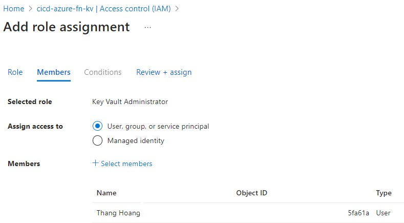

# Azure Key Vault Setup

## Key Vault Setup and Grant Key Vault Admin Role

Within Azure Portal, access cicd-azure-functions-rg resource group and hit create button. Search: azure key vault

    * Click Create, Key Vault
    * Give it a unique name: cicd-azure-fn-kv
    * Left remaining options default and clicked review + create button.
    * Click create button

Since using RBAC model, I'll grant my admin account Key Vault Administrator role.

    * Within the newly created Azure Key Vault, select Access control (IAM)
    * click Add role assignment.
    * Select Key Vault Administrator and select next button
    * Add my user account and click next

## Key Vault and Generate Secrets

Next, create two secrets that represent SQL Authentication account credentials. One secret represents the user and second secret represents the password.

Create First Secret
_ Within Key Vault, click Secrets
_ click Generate/Import button  
_ Upload options: manual
_ Name: sqlusr
_ Secret Value: az_fn_usr 
_ remaining options leave default

Create Second Secret
_ Within Key Vault, click Secrets
_ click Generate/Import button  
_ Upload options: manual
_ Name: sqlpasswrd
_ Secret Value: <your password here>
_ remaining options leave default

## Grant Azure Function Managed Identity access to read secrets

    * within Azure Key Vault, select Access Control (IAM)
    * click Add role assignment button
    * select Key Vault Secrets User
    * click Next
    * under members tab
        * Assign Access To: Managed Identity
        * Members: click to select members
        * use drop downs and locate your managed identity

